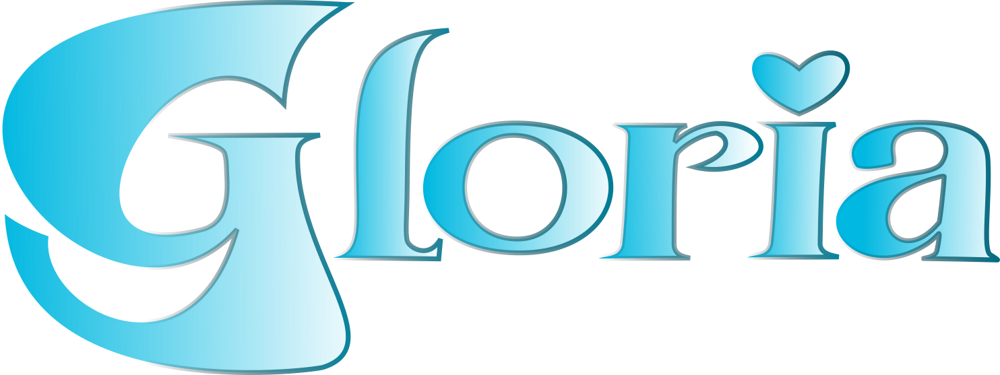

<html lang="es">
<head>
    <meta charset="UTF-8">
    <meta name="viewport" content="width=device-width, initial-scale=1.0">
    <title>Sanitas | Clínicas Dentales - Tu Clínica Dental de Confianza</title>
    <meta name="description" content="Sanitas Clínicas dentales con más de 15 años de experiencia. Implantes, ortodoncia invisible, estética dental y urgencias 24/7. Primera consulta gratuita.">
    
    <!-- Google Fonts -->
    <link rel="preconnect" href="https://fonts.googleapis.com">
    <link rel="preconnect" href="https://fonts.gstatic.com" crossorigin>
    <link href="https://fonts.googleapis.com/css2?family=Cormorant+Garamond:wght@400;600;700&family=DM+Sans:wght@400;500;600;700&family=Poppins:wght@300;400;600&display=swap" rel="stylesheet">

    
</head>
<body>
    <!-- Header -->
    <header class="header" id="header">
        <nav class="nav-container">
            

                
                
Clínica Dental

            

            
            <ul class="nav-menu">
                <li><a href="#inicio">Inicio</a></li>
                <li><a href="#nosotros">Nosotros</a></li>
                <li><a href="#servicios">Servicios</a></li>
                <li><a href="#equipo">Equipo</a></li>
                <li><a href="#contacto">Contacto</a></li>
            </ul>
            
            

                
                
                
            

        </nav>
    </header>

    <!-- Mobile Menu Overlay -->
    

    <!-- Hero Section -->
    <section class="hero" id="inicio">
        

            

                
Bienvenido a Sanitas

                <h1>Cuida tu salud dental con confianza</h1>
                

                    Tratamientos personalizados, tecnología de vanguardia y un equipo que te escucha. 
                    Tu sonrisa es nuestra prioridad.
                

                
                

                    <button class="btn btn-primary">📅 Reserva tu cita gratuita</button>
                    <button class="btn btn-secondary">📞 Llámanos ahora</button>
                

                
                

                    

                        
⭐

                        

                            15+ años
                            de experiencia
                        

                    

                    

                        
😊

                        

                            5,000+
                            pacientes felices
                        

                    

                    

                        
🚨

                        

                            24/7
                            urgencias
                        

                    

                

            

            
            

                
            

        

        
        

            
✓

            
Primera consulta

            
Gratis

        

        
        

            
⚡

            
Valoración

            
4.9/5

        

    </section>

    <!-- About Section -->
    <section class="about" id="nosotros">
        

            

                

                    
Sobre Nosotros

                    <h2>Conoce a tu nueva clínica dental de confianza</h2>
                    
                    

                        En Sanitas, entendemos que ir al dentista puede generar nerviosismo. Por eso hemos creado 
                        un espacio donde la tecnología más avanzada se combina con un trato cercano y humano.
                    

                    
                    

                        Con más de 15 años cuidando la salud dental de familias como la tuya, nuestro equipo de 
                        especialistas está comprometido con tu bienestar.
                    

                    
                    

                        

                            
🏆

                            

                                <h4>Clínica Certificada</h4>
                                
Autorizados y regulados

                            

                        

                        

                            
💳

                            

                                <h4>Financiación</h4>
                                
Hasta 36 meses sin intereses

                            

                        

                        

                            
⏰

                            

                                <h4>Horario Flexible</h4>
                                
Adaptado a ti

                            

                        

                        

                            
🛡️

                            

                                <h4>Garantía Total</h4>
                                
En todos nuestros tratamientos

                            

                        

                    

                

                
                

                    
                

            

        

    </section>

    <!-- Services Section -->
    <section class="services" id="servicios">
        

            

                
Nuestros Servicios

                <h2>Soluciones completas para tu salud dental</h2>
                

                    Desde cuidado preventivo hasta tratamientos especializados, todo en un solo lugar
                

            

            
            

                

                    
🦷

                    <h3>Odontología General</h3>
                    
Cuidado dental completo para toda la familia

                    <ul class="service-features">
                        <li>Revisiones y diagnóstico</li>
                        <li>Limpiezas dentales profundas</li>
                        <li>Obturaciones (empastes)</li>
                        <li>Endodoncias</li>
                    </ul>
                

                
                

                    
🔧

                    <h3>Implantes Dentales</h3>
                    
Recupera tu sonrisa de forma permanente

                    <ul class="service-features">
                        <li>Implantes de titanio biocompatible</li>
                        <li>Cirugía guiada por ordenador</li>
                        <li>Coronas sobre implantes</li>
                        <li>Prótesis fijas completas</li>
                    </ul>
                    Garantía de 10 años
                

                
                

                    
😁

                    <h3>Ortodoncia</h3>
                    
Alinea tu sonrisa con la técnica que prefieras

                    <ul class="service-features">
                        <li>Ortodoncia invisible (Invisalign)</li>
                        <li>Brackets metálicos y estéticos</li>
                        <li>Ortodoncia lingual</li>
                        <li>Retenedores personalizados</li>
                    </ul>
                    Primera consulta gratis
                

                
                

                    
✨

                    <h3>Estética Dental</h3>
                    
La sonrisa que siempre soñaste

                    <ul class="service-features">
                        <li>Blanqueamiento profesional</li>
                        <li>Carillas de porcelana</li>
                        <li>Diseño digital de sonrisa (DSD)</li>
                        <li>Reconstrucciones estéticas</li>
                    </ul>
                

                
                

                    
💊

                    <h3>Periodoncia</h3>
                    
Encías sanas, sonrisa duradera

                    <ul class="service-features">
                        <li>Tratamiento de gingivitis</li>
                        <li>Curetajes y raspados</li>
                        <li>Cirugía periodontal</li>
                        <li>Mantenimiento preventivo</li>
                    </ul>
                

                
                

                    
🚨

                    <h3>Urgencias Dentales</h3>
                    
Atención inmediata cuando más lo necesitas

                    <ul class="service-features">
                        <li>Atención en 24 horas</li>
                        <li>Tratamiento del dolor</li>
                        <li>Reparación de fracturas</li>
                        <li>Infecciones dentales</li>
                    </ul>
                    Disponible 24/7
                

            

        

    </section>

    
</body>
</html>

